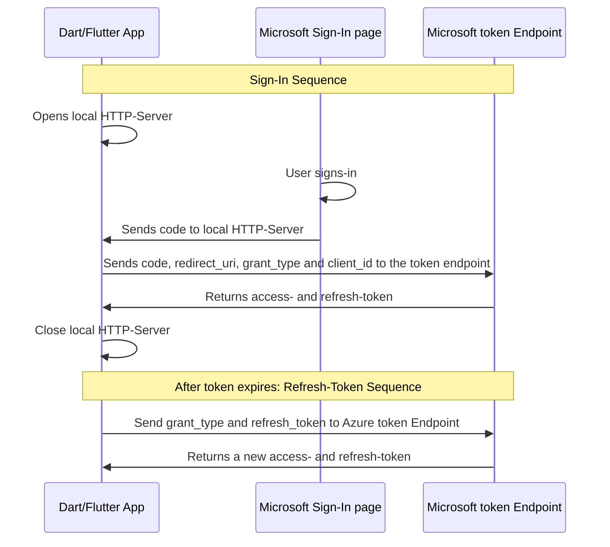

#  Dart package for Azure AD Sign In
</p>
<p align="center">
<a href="https://pub.dev/packages/dart_azure_ad_sign_in"></a>
<a href="https://circleci.com/Pat992/dart_azure_ad_sign_in/tree/master">
        </a>
<a href="https://github.com/Pat992/dart_azure_ad_sign_in"></a>
<a href="https://opensource.org/licenses/BSD 3-Clause"></a>
</p>

## 1. Platform Support
| | Dart | Flutter | Dart - Tested on | Flutter - Tested on |
| ----------- | ----------- | ----------- | ----------- | ----------- |
| Android | :heavy_multiplication_x: | :heavy_check_mark: | - | Tested on Pixel 4 (Emulator) and Xiaomi P9 |
| iOS | :heavy_multiplication_x: | :heavy_minus_sign: | - | Not yet tested, but should work |
| Linux | :heavy_check_mark: | :heavy_check_mark: | Tested on Ubuntu 22.04 LTS | Tested on Ubuntu 22.04 LTS |
| MacOS | :heavy_minus_sign: | :heavy_minus_sign: | Not yet tested, but should work | Not yet tested, but should work |
| Web | :heavy_multiplication_x: | :heavy_multiplication_x: | uses dart.io for the HttpServer, will not work | uses dart.io for the HttpServer, will not work |
| Windows | :heavy_check_mark: | :heavy_check_mark: | Tested on Windows 11 | Tested on Windows 11 |

## 2. Features
dart_azure_ad_sign_in allows Flutter and Dart apps to optain authentication tokens for authorized access to protected resources like web APIs.
The package can simply be used without any configuration to gain the same access you would have with the **[az cli](https://learn.microsoft.com/en-us/cli/azure/)**, or it can be configurated to modify the access.

## 3. Authentication Flow



## 4. Getting started
Add the dependency to the pubspec.yaml for Dart and Flutter
```yaml
dependencies:
  dart_azure_ad_sign_in: ^1.0.0
```
Or Run this command with Dart:
```powershell
dart pub add dart_azure_ad_sign_in
```
With Flutter:
```powershell
flutter pub add dart_azure_ad_sign_in
```
Import the package:
```dart
import 'package:dart_azure_ad_sign_in/dart_azure_ad_sign_in.dart';
```

## 5. Usage

### 5.1 AzureSignIn instance creation and configuration
The class itself is very flexible, no parameters need to be set and it will use the **[az cli](https://learn.microsoft.com/en-us/cli/azure/)** configuration.
For information on all available variables in this class, refer to **5.5 AzureSignIn Variables**

#### 5.1.1 Creating instance without parameters (using az cli default settings)
```dart
    final azureSignIn = AzureSignIn();
```

#### 5.1.2 Creating instance with parameters
Parameters for the Authentication and local Http-Server can be set if needed.
```dart
  final azureSignIn = AzureSignIn(
    // The Application (client) ID that the Azure portal – App registrations page assigned to your app.
    // Optional, uses the az cli client id: '04b07795-8ddb-461a-bbee-02f9e1bf7b46'
    clientId: '04b07795-8ddb-461a-bbee-02f9e1bf7b46',
    // A list of scopes that you want the user to consent to.
    // Optional, uses the az cli scope: ['https://management.core.windows.net//.default', 'offline_access', 'openid', 'profile']
    scope: [
      'https://management.core.windows.net//.default',
      'offline_access',
      'openid',
      'profile',
    ],
    // Port of the Local HttpServer which will receive the code after sign in.
    // Optional, uses the port 5000
    port: 5000,
    // Response of the Local HttpServer, which the user will see after successful sign in.
    // Optional, uses 'Sign In successful. This window can now be closed.'
    serverSuccessResponse: '<h1>Sign In successful.</h1><p>This window can now be closed.</p>',
    // Response of the Local HttpServer, which the user will see after sign in failure.
    // Optional, uses 'Sign In failed. Close this window and try again.'
    serverErrorResponse: '<h1>Sign In failed.</h1><p>Close this window and try again.</p>',
    // Duration on how long the local HttpServer waits, for the user to sign in before creating a cancelled-token and closing.
    // Optional, uses Duration(minutes: 5)
    signInTimeoutDuration: Duration(minutes: 5),
  );
```
### 5.2 Sign In

#### 5.2.1 Get the Sign Microsoft Sign-In page URL
The user needs to sign-in in the Browser, to do so the Sign In URL can be received.
If Flutter is being used, this URL could be opened with the **[url_launcher](https://pub.dev/packages/url_launcher)**
```dart
    // Print the SignIn URL, the user has to open in the browser.
    print(azureSignIn.signInUri);
```

#### 5.2.2 Start the Sign In process
The signIn will return a new `Token`.
In the background a `HttpServer` is started and waits for the code received after the sign-in, 
then the **Microsoft token Endpoint** will be called with the code and a token is returned.
The `Token` will always be created, but depending on success or error, different values will be set, see `token.status` in **5.6 The Token-Entity**.
```dart
    Token token = await azureSignIn.signIn();
```

### 5.3 Cancel Sign In
The signIn Process itself has the defined timeout in `azureSignIn.signInTimeoutDuration`,
but with the following function the user could cancel the Sign in if needed.
The `azureSignIn.signIn()` will then receive a `Token` with the information of a cancelled sign in via `token.status` (See more: **5.6 The Token-Entity**).
```dart
    // Cancels the sign-in process.
    async azureSignIn.cancelSignIn();
```

### 5.4 Refresh Token
Once the token expires it can be either refreshed by giving it the existing `Token` or just giving it a refresh-token String.
On of the Values needs to be sent, else a `Token` with a error-status will be returned, see `token.status` in **5.6 The Token-Entity**.

#### 5.4.1 Refresh Token with a `Token`
The Token can be refreshed by using the existing `Token`
```dart
    // refresh a token by giving the previous aquired token object.
    token = await azureSignIn.refreshToken(token: token);
```

#### 5.4.1 Refresh Token with the Refresh-Token String
Or if the `Token` is not available anymore the refresh-token can be sent used.
```dart
    // refresh a token by giving the refresh-token as a string.
    token = await azureSignIn.refreshToken(refreshToken: refreshTokenString);
```

### 5.5 AzureSignIn Variables
Some class variables can be modfied while running, some others are read-only.
| Name | Type | Default value | Can be modified | Description |
| ----------- | ----------- | ----------- | ----------- | ----------- |
| `azureSignIn.clientId` | String | 04b07795-8ddb-461a-bbee-02f9e1bf7b46 | :heavy_check_mark: | The Application (client) ID that the Azure portal – App registrations page assigned to your app. Uses the **az cli** client ID by default, no app registration necessary. |
| `azureSignIn.scope` | List\<String\> | [<br />'https://management.core.windows.net//.default',<br />'offline_access',<br />'openid',<br />'profile'<br />] | :heavy_check_mark: | A space-separated list of scopes that you want the user to consent to. For the /authorize leg of the request, this parameter can cover multiple resources. This value allows your app to get consent for multiple web APIs you want to call. Uses the **az cli** Scopes by default |
| `azureSignIn.grantType` | String | authorization_code | :heavy_multiplication_x: | Grant Type for the authorization flow. Must be **authorization_code** for the authorization code flow. |
| `azureSignIn.port` | int | 5000 | :heavy_check_mark: | Port of the Local `HttpServer` which will receive the code after sign in. |
| `azureSignIn.signInTimeoutDuration` | Duration() | `Duration(minutes: 5)` | :heavy_check_mark: | Duration on how long the local `HttpServer` waits, for the user to sign in, before closing. |
| `azureSignIn.serverSuccessResponse` | String | Sign In successful. This window can now be closed. | :heavy_check_mark: | Response of the Local HttpServer, which the user will see after successfully logging in, can be simple Text or HTML. |
| `azureSignIn.serverErrorResponse` | String | Sign In failed. Close this window and try again. | :heavy_check_mark: | Response of the Local HttpServer, which the user will see after sign in failure, can be simple Text or HTML. |
| `azureSignIn.signInUri` | String | https://login.microsoftonline.com/organizations/oauth2/v2.0/authorize<br />?client_id=[CLIENT_ID]<br />&response_type=code<br />&redirect_uri=http://localhost:[PORT]<br />&scope=[SCOPE]<br />&response_mode=form_post | :heavy_multiplication_x: | Getter for the Microsoft Sign-In URL used to Sign In via Browser. Combines `azureSignIn.clientId`, `azureSignIn.port` and `azureSignIn.scope` |
| `azureSignIn.signOutUri` | String | https://login.microsoftonline.com/common/oauth2/v2.0/logout | :heavy_multiplication_x: | Azure Auth URL used to Sign out from the Browser |

### 5.6 The Token-Entity
The Token has multiple fields, some are set in case of success, some in case of a failure.
| Name | Type | Example | Description |
| ----------- | ----------- | ----------- | ----------- |
| `token.tokenType` | String | Bearer | Indicates the token type value. The only type that Azure AD supports is **Bearer** |
| `token.scope` | String | user_impersonation | The scopes that the **access_token** is valid for. Optional. This parameter is non-standard and, if omitted, the token is for the scopes requested on the initial leg of the flow. |
| `token.expiresIn` | String | 5084 | How long the access token is valid, in seconds. |
| `token.extExpiresIn` | String | 5084 | Used to indicate an extended lifetime for the access token and to support resiliency when the token issuance service is not responding. |
| `token.expiresOn` | String | 1674580651 | Timestamp when the token expires. |
| `token.notBefore` | String | 1674575266 | The time at which the token becomes valid, represented in epoch time. This time is usually the same as the time the token was issued. Azure AD B2C validates this value, and rejects the token if the token lifetime is not valid. |
| `token.resource` | String | https://management.core.windows.net/ | Resource the token has access to. |
| `token.accessToken` | String | eyJ0eXAiOiJKV1QiLCJhbGciOiJS... | The requested access token. The app can use this token to authenticate to the secured resource, such as a web API. |
| `token.refreshToken` | String | 0.AQUAjHBCWE0CK06v4qgD88sl3Z... | An OAuth 2.0 refresh token. The app can use this token to acquire other access tokens after the current access token expires. Refresh tokens are long-lived. They can maintain access to resources for extended periods.|
| `token.idToken` | String | eyJ0eXAiOiJKV1QiLCJhbGciOiJSUzI1NiIs... | A JSON Web Token. The app can decode the segments of this token to request information about the user who signed in. The app can cache the values and display them, and confidential clients can use this token for authorization. |
| `token.foci` | String | 1 | Access to Microsoft Office apps while they have a session on a mobile device using FOCI (Family of Client IDs). |
| `token.status` | int | 0: Success<br />1: Azure API error<br />2: HttpServer error<br />3: Sign In cancelled | Status of the Token authorization code flow result. |
| `token.error` | String | invalid_grant | An error code string that can be used to classify types of errors, and to react to errors. |
| `token.errorDescription` | String | AADSTS900144: The request body must contain the following parameter: 'code'... | An error code string that can be used to classify types of errors, and to react to errors. |
| `token.errorCodes` | List\<dynamic\> | [900144] | A list of STS-specific error codes that can help in diagnostics. |
| `token.errorUri` | String | https://login.microsoftonline.com/error?code=900144 | URL to a Microsoft documentation, concerning the emerged error. |

## 6 Additional information

TODO: Tell users more about the package: where to find more information, how to 
contribute to the package, how to file issues, what response they can expect 
from the package authors, and more.